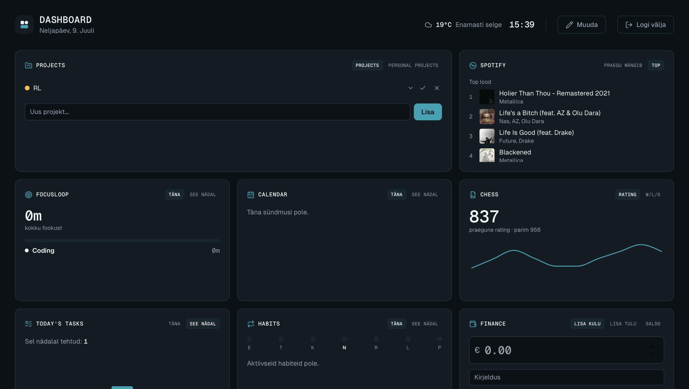

# Dashboard

A personal dashboard that pulls together five independent data sources — FinanceTracker, TaskZen
(Tasks/Habits/Projects/FocusLoop), EstHoop, GitHub, and Spotify — behind a single dual-session
login. Widgets are freely reorderable (drag-and-drop edit mode), and an AI-generated daily summary
ties the day's activity together in one line at the bottom of the page.

## Screenshot



## Features

- **GitHub Contributions** — commit calendar (area chart), contribution type breakdown, and
  language distribution, backed by the GitHub GraphQL API.
- **Finance** — add expenses/income and view the current month's balance, backed by the
  FinanceTracker Supabase project.
- **Tasks / Habits** — daily tasks and habit tracking with weekly progress strips, backed by the
  TaskZen Supabase project.
- **Projects** — TaskZen projects and subtasks, with criticality tagging and inline
  create/complete/delete.
- **FocusLoop** — today's/this week's focus time by activity, with a proportional time-split bar.
- **Chess** — Chess.com rating, rating trend, and win/loss/draw record (today + all-time).
- **Calendar** — this week's Google Calendar events.
- **Spotify** — now playing (with playback controls) and top tracks/artists.
- **EstHoop** — next Estonian national basketball team game (live countdown) and the last game's
  result + top scorer, pulled from a separate EstHoop backend.
- **Daily summary** — an Anthropic-generated one-paragraph recap of the day's tasks, habits,
  focus time, weather, chess games, and GitHub activity, generated once per day after 20:00.
- **Edit mode** — a header toggle puts widgets into a jiggle-and-drag reorder mode (iOS
  home-screen style); the new layout is saved per-user and synced across devices.

## Tech stack

**Frontend** — Next.js 14 (App Router), React 18, TypeScript, Tailwind CSS, TanStack Query (data
fetching/caching), Recharts (charts), @dnd-kit (drag-and-drop widget reordering), lucide-react
(icons).

**Backend** — No dedicated backend server. Two separate [Supabase](https://supabase.com) projects
(Postgres + Auth) — one for FinanceTracker, one for TaskZen (tasks/habits/projects/focus
sessions) — accessed directly from the client. A handful of Next.js Route Handlers under
`app/api/*` proxy any third-party API that needs a secret (GitHub, Google Calendar, Spotify,
Anthropic), so those tokens never reach the browser. Weather (open-meteo), Chess.com, and EstHoop
are public, unauthenticated APIs called directly from the client.

**Hosting** — [Vercel](https://vercel.com).

## Project structure

```
app/
  api/
    calendar/                Google Calendar OAuth refresh-token flow
    github/                   GitHub GraphQL query
    spotify/now-playing|top|control/   Spotify Web API (split by refresh cadence)
    summary/                  Anthropic daily-summary generation
  page.tsx                    Dashboard home page (auth gate, edit-mode, widget grid)
  layout.tsx                  Fonts (Geist Sans/Mono, Newsreader serif) + providers
components/
  widgets/                    One component per data source (11 total)
  ui/                         Reusable primitives: Card, Button, Skeleton, TabButton,
                               CheckToggle, WeekStrip, WeeklyChart, WidgetTitle, chartTheme
  SortableWidget.tsx           dnd-kit wrapper: jiggle animation + drag handle in edit mode
lib/
  supabase/                    financeClient.ts and tasksClient.ts — the two Supabase projects
  spotify/token.ts             Shared Spotify access-token refresh helper
  queries/                     TanStack Query hooks, one file per data source
  widgets.ts                   Widget registry (id, component, grid col-span)
  date.ts                      Shared week/month date-range helpers
  countryFlags.ts               Country name → flag emoji, for EstHoop opponents
providers/
  AuthProvider.tsx              Dual Supabase session management (sign in/out both projects)
  QueryProvider.tsx             TanStack Query client
```

## Getting started

1. Copy the env example and fill in the values:

   ```bash
   cp .env.local.example .env.local
   ```

2. Install dependencies:

   ```bash
   npm install
   ```

3. Run the dev server:

   ```bash
   npm run dev
   ```

   Open [http://localhost:3000](http://localhost:3000).

### Environment variables

See `.env.local.example` for the full annotated list, including setup steps for Google Calendar
and Spotify's OAuth refresh-token flows.

| Variable | Purpose |
|---|---|
| `NEXT_PUBLIC_FINANCE_SUPABASE_URL` / `_ANON_KEY` | FinanceTracker Supabase project |
| `NEXT_PUBLIC_TASKS_SUPABASE_URL` / `_ANON_KEY` | TaskZen Supabase project |
| `NEXT_PUBLIC_ESTHOOP_API_URL` | EstHoop FastAPI backend base URL |
| `NEXT_PUBLIC_CHESS_USERNAME` | Chess.com username |
| `GITHUB_TOKEN` | GitHub GraphQL API (server-only) |
| `GOOGLE_CLIENT_ID` / `_SECRET` / `GOOGLE_REFRESH_TOKEN` | Google Calendar API (server-only) |
| `SPOTIFY_CLIENT_ID` / `_SECRET` / `SPOTIFY_REFRESH_TOKEN` | Spotify Web API (server-only) |
| `ANTHROPIC_API_KEY` | Daily summary generation (server-only) |

On Vercel these must be set in Project Settings → Environment Variables — `.env.local` is never
read by Vercel.

## Database setup

Both Supabase projects need their tables and Row Level Security policies created manually via the
Supabase SQL editor before first use — there's no schema file checked into this repo, since the
TaskZen and FinanceTracker schemas are owned by their own projects. Every table should be scoped
to the authenticated user via `user_id = auth.uid()` RLS policies (see `dashboard_layout` for an
example of the pattern used for dashboard-specific tables).

## Scripts

| Command | What it does |
|---|---|
| `npm run dev` | Start the dev server |
| `npm run build` | Build the app for production |
| `npm run start` | Serve the production build locally |
| `npm run lint` | Run ESLint |
| `npm run format` | Run Prettier (with Tailwind class sorting) |
| `npx tsc --noEmit` | Type-check (no dedicated script; there is no test suite) |

## Deployment

Deployed on [Vercel](https://vercel.com). Set the environment variables above in the project
settings, then push to the connected branch.

## Notes on the architecture

- **Dual-session auth** — `AuthProvider` signs into *two* separate Supabase projects concurrently
  (FinanceTracker + TaskZen) with one email and two passwords. The dashboard gates on *both*
  sessions being present; a single missing session is treated as logged out.
- **No shared backend between the two Supabase projects** — `financeClient.ts` and
  `tasksClient.ts` are deliberately separate singleton clients; finance data and tasks/habits/
  focus/projects data live in physically different Postgres databases.
- **Secrets never reach the browser** — any API requiring a token (GitHub, Google Calendar,
  Spotify, Anthropic) is called only from `app/api/*` Route Handlers. Spotify is split across
  three routes (`now-playing`, `top`, `control`) specifically because now-playing polls every
  15s while top tracks/artists and playback control don't need to.
- **Widget layout is data-driven, not hardcoded** — `app/page.tsx` renders from an ordered array
  of widget IDs (`lib/widgets.ts`), not a fixed JSX list, so drag-and-drop reordering just
  reorders that array and persists it to a `dashboard_layout` table. The "Daily summary" widget
  is intentionally excluded from the reorderable registry and pinned full-width at the page
  footer.
- **EstHoop is a separate project** — its FastAPI backend
  ([github.com/ErkoKaar/EstHoop](https://github.com/ErkoKaar/EstHoop)) is a public, read-only API;
  the backend's CORS allowlist must include this dashboard's origin.
